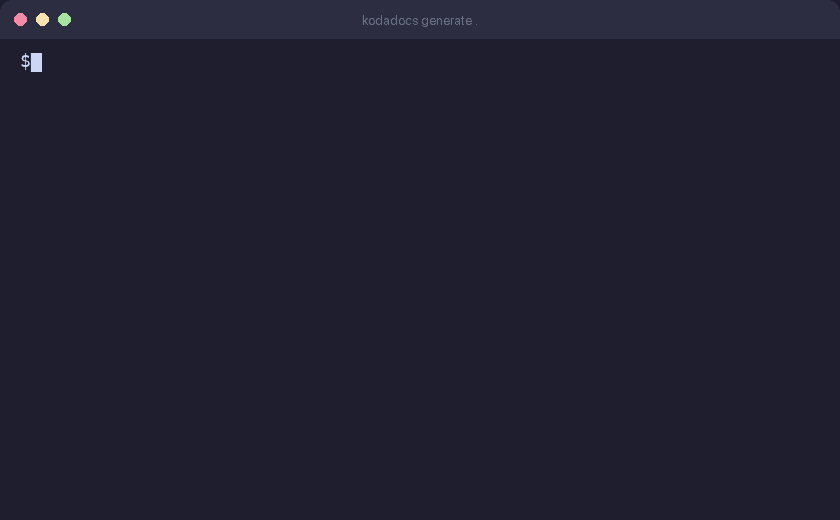

# KodaDocs

[](https://pypi.org/project/kodadocs/)
[](https://pypi.org/project/kodadocs/)
[](https://github.com/kodadocs/kodadocs/stargazers)
[](https://opensource.org/licenses/MIT)
[](https://www.python.org/downloads/)

**[kodadocs.com](https://kodadocs.com)** | **[Docs](https://kodadocs-help.kodadocs.com/)** | AI-generated help docs for your web app — in minutes, not weeks.

KodaDocs is an open-source Claude Code MCP tool. Install it, tell Claude "Generate docs for my app", and get a complete help center with annotated screenshots and AI-written articles. Free to self-host. [Pro Kit ($29)](https://kodadocs.com/pro) for unlimited pages, 12 skill workflows, and all premium themes. Optional [hosted deploy ($5/mo)](https://kodadocs.com/#pricing) to `yourapp.kodadocs.com`.

<p align="center">
  
</p>

## Quick Start

Add the MCP server to your Claude Code config (`~/.claude/settings.json`):

```json
{
  "mcpServers": {
    "kodadocs": {
      "command": "uvx",
      "args": ["kodadocs", "mcp"]
    }
  }
}
```

Install the browser for screenshots (one-time):

```bash
uvx --with kodadocs playwright install chromium
```

Then tell Claude:

> "Generate help docs for my app"

Claude reads your code, captures screenshots, writes documentation, and assembles a VitePress help center — all through MCP tools.

### CLI (optional)

For power users who want direct CLI access:

```bash
pip install kodadocs
kodadocs generate .
kodadocs deploy .
```

## Showcase

See what KodaDocs generates — these docs were created in under 2 minutes:

| Project | Framework | Live Docs |
|---------|-----------|-----------|
| Hono | Hono | [hono.kodadocs.com](https://hono.kodadocs.com) |
| Drizzle | Drizzle ORM | [drizzle.kodadocs.com](https://drizzle.kodadocs.com) |
| Create T3 App | Next.js | [create-t3-app.kodadocs.com](https://create-t3-app.kodadocs.com) |

<!-- Add your project! Open a PR or tweet @KodaDocs -->

> Want to see your project here? Generate docs with KodaDocs and [let us know](https://github.com/kodadocs/kodadocs/issues).

## How It Works

```
Your web app ──► KodaDocs ──► Complete help center
                   │
                   ├── Detects framework (Next.js, Django, Flask, WordPress, ...)
                   ├── Discovers routes from source code
                   ├── Launches headless browser & authenticates
                   ├── Captures screenshots with PII blurring
                   ├── Draws numbered callouts on UI elements
                   ├── Claude writes all articles
                   └── Assembles VitePress site & deploys
```

| Phase | What happens |
|-------|-------------|
| **Discovery** | Detects framework, discovers routes from code |
| **Capture** | Launches headless browser, authenticates, captures screenshots |
| **Annotation** | Draws numbered callouts on UI elements |
| **Doc Writing** | Claude writes all articles (Getting Started, Feature Guides, FAQ, Troubleshooting) |
| **Assembly** | Assembles VitePress site with branding, search, and mobile layout |
| **Deploy** | Deploys to Cloudflare, Vercel, Netlify, GitHub Pages, or kodadocs.com |

## Supported Frameworks

Next.js, Nuxt, React, Vue, Angular, SvelteKit, Remix, Astro, Django, Flask, FastAPI, Rails, Laravel, Express, Hono, WordPress, Chrome Extensions, and more.

## MCP Tools

| Tool | Description |
|------|-------------|
| `detect_framework` | Auto-detect web framework from project files |
| `discover_routes` | Static analysis of routes, services, and metadata |
| `analyze_codebase` | Tree-sitter parsing for code chunks, error patterns, data models |
| `capture_screenshots` | Headless browser capture with auth and PII blur |
| `annotate_screenshots` | Numbered callouts on UI elements via Pillow |
| `assemble_vitepress` | Build complete VitePress site from articles + screenshots |
| `deploy_site` | Deploy to hosting provider |
| `save_manifest` / `load_manifest` | Persist and load pipeline state |

## Claude Code Skill

KodaDocs includes a [skill file](kodadocs/skill/kodadocs.md) that teaches Claude how to orchestrate the full pipeline. To install it:

```bash
mkdir -p .claude/skills
cp kodadocs/skill/kodadocs.md .claude/skills/kodadocs.md
```

## CLI

KodaDocs also works as a standalone CLI (requires `pip install kodadocs`):

```bash
kodadocs generate .                              # Run full pipeline
kodadocs generate . --url http://localhost:3000   # Override app URL
kodadocs generate . --user admin --pass secret    # Auth-gated apps
kodadocs deploy . --provider cloudflare           # Deploy to provider
kodadocs init .                                   # Interactive setup wizard
kodadocs config .                                 # View/update config
kodadocs mcp                                      # Start MCP server
```

## Auth-Gated Apps

KodaDocs handles apps behind login walls automatically:

1. Provide credentials via `kodadocs init` or `--user` / `--pass` flags
2. KodaDocs logs in via headless browser, saves the session
3. Post-auth crawl discovers routes invisible to unauthenticated visitors
4. All screenshots are captured in the authenticated session

## API Key

KodaDocs requires an [Anthropic API key](https://console.anthropic.com/) to generate documentation.

**With Claude Code (MCP):** The API key is provided automatically — no setup needed.

**With the CLI:** Set the key in your environment:

```bash
export ANTHROPIC_API_KEY=sk-ant-...
```

## Pricing

| Feature | Free | Pro Kit ($29) | + Hosting ($5/mo) |
|---------|------|---------------|-------------------|
| Pages per generation | 15 | Unlimited | Unlimited |
| Frameworks | All 18+ | All 18+ | All 18+ |
| Themes | Default | All 6+ premium | All 6+ premium |
| Custom branding | No | Yes | Yes |
| Auth-gated apps | No | Yes | Yes |
| Skill files | — | 12 pro workflows | 12 pro workflows |
| Badge | Always shown | Removable | Removable |
| Self-host deploy | Yes | Yes | Yes |
| Managed hosting | — | — | yourapp.kodadocs.com |
| Custom domain | — | — | help.yourapp.com |
| Search analytics | — | — | Yes |

Users bring their own Anthropic API key — generation is never gated.

**[Get the Pro Kit](https://kodadocs.com/pro)** — unlimited pages, premium themes, and 12 pro skill workflows.

## Contributing

See [CONTRIBUTING.md](kodadocs/CONTRIBUTING.md) for development setup and guidelines.

## License

MIT
